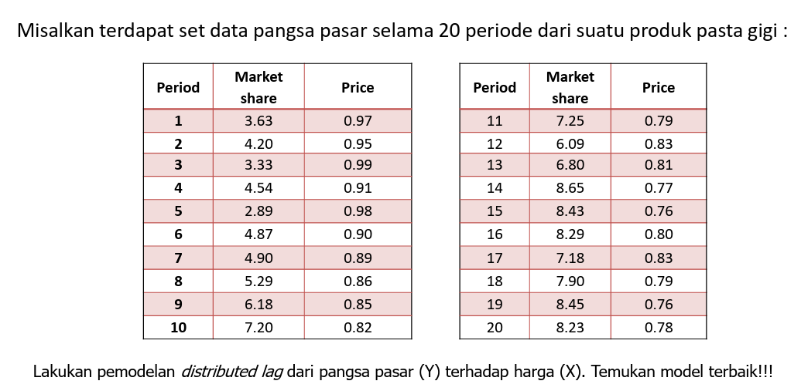
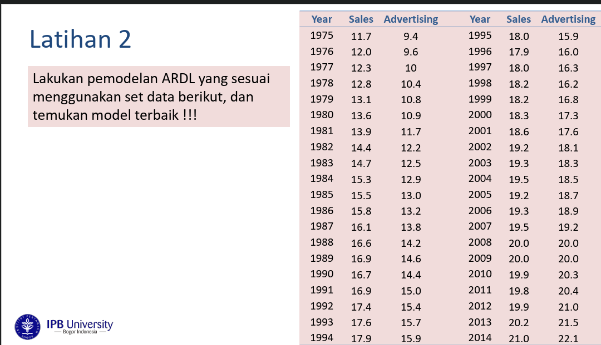

## *Packages*

```{r}
#install.packages("dLagM") #install jika belum ada
#install.packages("dynlm") #install jika belum ada
#install.packages("MLmetrics") #install jika belum ada
library(dLagM)
library(dynlm)
library(MLmetrics)
library(lmtest)
library(car)
```

# Latihan 1

## Impor Data



```{r}
data_latihan1 <- data.frame(
  Period = 1:20,
  Market_share = c(3.63, 4.20, 3.33, 4.54, 2.89, 4.87, 4.90, 5.29, 6.18, 7.20, 
                   7.25, 6.09, 6.80, 8.65, 8.43, 8.29, 7.18, 7.90, 8.45, 8.23),
  Price = c(0.97, 0.95, 0.99, 0.91, 0.98, 0.90, 0.89, 0.86, 0.85, 0.82, 
            0.79, 0.83, 0.81, 0.77, 0.76, 0.80, 0.83, 0.79, 0.76, 0.78)
)
```

## Split Data

```{r}
train1 <- data_latihan1[1:15,]
test1 <- data_latihan1[16:20,]
```

## Model Koyck

```{r}
model.koyck1 <- koyckDlm(x = train1$Price, y = train1$Market_share)
summary(model.koyck1)

fore.koyck1 <- forecast(model = model.koyck1, x = test1$Price, h = 5)
mape.koyck1 <- MAPE(fore.koyck1$forecasts, test1$Market_share)
```
Pengujian parameter secara individu menunjukkan tidak ada peubah yang signifikan secara parsial (P-value > 0.05 untuk Intercept, Y.1, dan X.t). Namun, pengujian secara simultan (Wald test) menunjukkan model signifikan secara keseluruhan dengan Adjusted R-squared sebesar 0.8861.

## Model DLM

```{r}
opt_dlm1 <- finiteDLMauto(formula = Market_share ~ Price,
                          data = data.frame(train1), q.min = 1, q.max = 5,
                          model.type = "dlm", error.type = "AIC", trace = TRUE)

q_opt_dlm1 <- 2 

model.dlm1 <- dlm(x = train1$Price, y = train1$Market_share, q = q_opt_dlm1)
summary(model.dlm1)

fore.dlm1 <- forecast(model = model.dlm1, x = test1$Price, h = 5)
mape.dlm1 <- MAPE(fore.dlm1$forecasts, test1$Market_share)
```
Variabel Intercept dan harga pada waktu sekarang (x.t) terbukti berpengaruh sangat signifikan terhadap Market share (P-value < 0.01). Sebaliknya, lag harga pada periode 1 dan 2 (x.1, x.2) tidak memiliki pengaruh yang signifikan. Model ini menjelaskan 94.04% keragaman data.

## Model ARDL

```{r}
model.ardl.opt1 <- ardlBoundOrders(data = data.frame(train1), ic = "AIC", 
                                   formula = Market_share ~ Price,
                                   max.p = 5, max.q = 5) 

min_p1 = c()
for(i in 1:length(model.ardl.opt1$Stat.table)){
  min_p1[i] = min(model.ardl.opt1$Stat.table[[i]], na.rm = TRUE)
}

q_opt_ardl1 = which(min_p1 == min(min_p1, na.rm = TRUE))[1]
p_opt_ardl1 = which(model.ardl.opt1$Stat.table[[q_opt_ardl1]] == min(model.ardl.opt1$Stat.table[[q_opt_ardl1]], na.rm = TRUE))[1]

model.ardl1 <- ardlDlm(formula = Market_share ~ Price, 
                       data = train1, p = p_opt_ardl1, q = q_opt_ardl1)
summary(model.ardl1)

fore.ardl1 <- forecast(model = model.ardl1, x = test1$Price, h = 5)
mape.ardl1 <- MAPE(fore.ardl1$forecasts, test1$Market_share)
```
Searah dengan hasil DLM, hanya variabel harga saat ini (Price.t) yang signifikan memengaruhi Market share (P-value = 0.000532). Lag dari harga maupun lag dari Market share tidak signifikan secara parsial.

## Perbandingan Model

```{r}
akurasi_latihan1 <- matrix(c(mape.koyck1, mape.dlm1, mape.ardl1))
row.names(akurasi_latihan1) <- c("Koyck", "DLM", "ARDL")
colnames(akurasi_latihan1) <- c("MAPE")
akurasi_latihan1
```
Berdasarkan metrik Mean Absolute Percentage Error (MAPE) pada data testing, Model Koyck merupakan model terbaik dengan tingkat kesalahan terkecil yakni 5.31% (0.0531), disusul oleh ARDL (6.26%) dan DLM (7.05%). Meskipun koefisien Koyck tidak signifikan secara parsial, model ini paling akurat untuk memproyeksikan data masa depan.


# Latihan 2

## Impor Data



```{r}
data_latihan2 <- data.frame(
  Year = 1975:2014,
  Sales = c(11.7, 12.0, 12.3, 12.8, 13.1, 13.6, 13.9, 14.4, 14.7, 15.3, 
            15.5, 15.8, 16.1, 16.6, 16.9, 16.7, 16.9, 17.4, 17.6, 17.9, 
            18.0, 17.9, 18.0, 18.2, 18.2, 18.3, 18.6, 19.2, 19.3, 19.5, 
            19.2, 19.3, 19.5, 20.0, 20.0, 19.9, 19.8, 19.9, 20.2, 21.0),
  Advertising = c(9.4, 9.6, 10.0, 10.4, 10.8, 10.9, 11.7, 12.2, 12.5, 12.9, 
                  13.0, 13.2, 13.8, 14.2, 14.6, 14.4, 15.0, 15.4, 15.7, 15.9, 
                  15.9, 16.0, 16.3, 16.2, 16.8, 17.3, 17.6, 18.1, 18.3, 18.5, 
                  18.7, 18.9, 19.2, 20.0, 20.0, 20.3, 20.4, 21.0, 21.5, 22.1)
)
```

## Split Data

```{r}
train2 <- data_latihan2[1:35,]
test2 <- data_latihan2[36:40,]
```

## Model ARDL

```{r}
model.ardl.opt2 <- ardlBoundOrders(data = data.frame(train2), ic = "AIC", 
                                   formula = Sales ~ Advertising)

min_p2 = c()
for(i in 1:length(model.ardl.opt2$Stat.table)){
  min_p2[i] = min(model.ardl.opt2$Stat.table[[i]], na.rm = TRUE)
}

q_opt_ardl2 = which(min_p2 == min(min_p2, na.rm = TRUE))[1]
p_opt_ardl2 = which(model.ardl.opt2$Stat.table[[q_opt_ardl2]] == min(model.ardl.opt2$Stat.table[[q_opt_ardl2]], na.rm = TRUE))[1]

model.ardl2 <- ardlDlm(formula = Sales ~ Advertising, 
                       data = train2, p = p_opt_ardl2, q = q_opt_ardl2)
summary(model.ardl2)

fore.ardl2 <- forecast(model = model.ardl2, x = test2$Advertising, h = 5)
mape.ardl2 <- MAPE(fore.ardl2$forecasts, test2$Sales)
mape.ardl2
```
Algoritma seleksi AIC membentuk model dengan lag yang panjang (hingga lag 10 untuk Advertising dan lag 8 untuk Sales). Mayoritas lag tersebut tidak signifikan secara parsial, dengan Advertising saat ini (Advertising.t) hanya signifikan pada taraf nyata 10% (P-value = 0.0522).

# Pemodelan dengan dynlm

```{r}
# Menggunakan data latihan 1 sebagai contoh konversi ke time series
train1.ts <- ts(train1)

# Contoh model DLM dengan q=2 menggunakan dynlm
model.dynlm <- dynlm(Market_share ~ Price + L(Price) + L(Price, 2), data = train1.ts)
summary(model.dynlm)
```
Pendekatan alternatif menggunakan fungsi dynlm pada data Latihan 1 menunjukkan hasil parameter yang konsisten dengan pemodelan DLM sebelumnya, di mana variabel harga saat ini (Price) berpengaruh signifikan terhadap Market share, menghasilkan Adjusted R-squared sebesar 0.9404.
